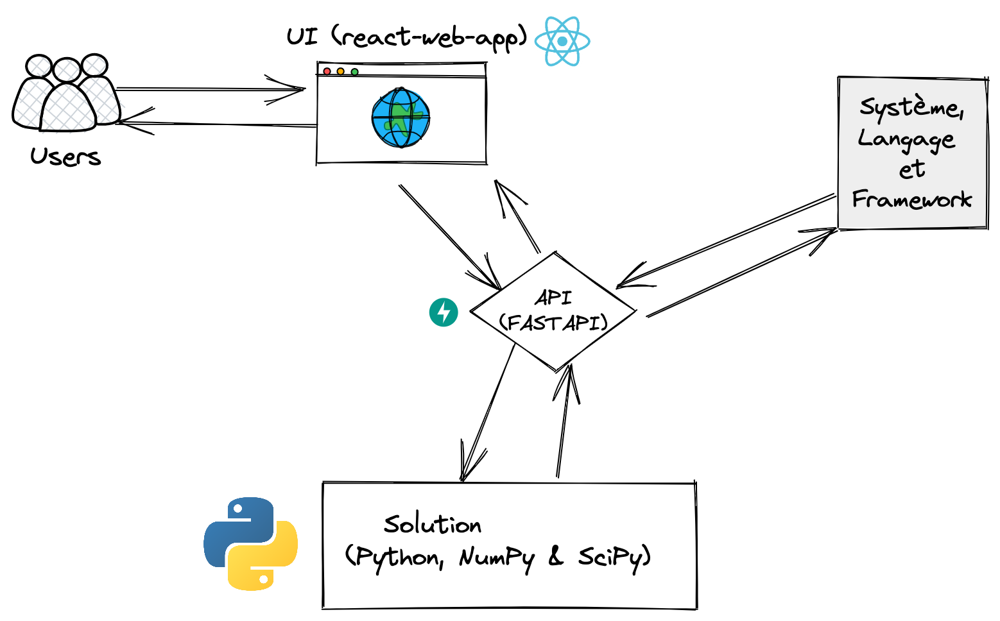

# MCNFP
Project to solve The minimum-cost network flow problem (MCNFP) with FastAPI/Python (Numpy and Scipy ) for problem Resolution and React JS for User Interface (UI - Frontend)

## project architecture diagram 

